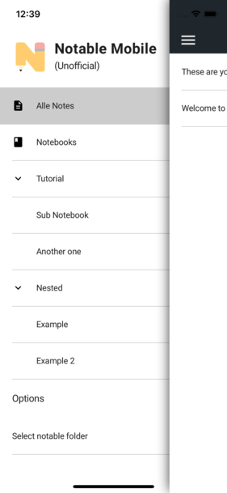

# Notable Mobile

**This is no official app.** It is inspired by [notable](https://github.com/notable/notable), a markdown editor for PC and Mac.

It is in an early state so there are many features which are not supported yet (but maybe in future).

**I am happy about every support. :)**



## Getting Started

This app is built with react-native:

```bash
git clone ...
cd notable-mobile
npm i
react-native run-android
// or: react-native run-ios
```

Once the app is started, navigate to your `notable` folder and select the `notes` folder inside. After that you should see the list of note-files stored in there.

## Sync files

You have to sync your notable folder from your PC or Mac with your smartphone on your own. You can use for example Dropbox, Google Drive, Nextcloud and so on.

## Future

This app is not fully featured yet. The following are the only features supported yet:

Feature            | Status
------------------ | ------------------
Display Notes      | :white_check_mark:
Edit Note Content  | :white_check_mark:
Display Notebooks  | :white_check_mark:
Filter Notebooks   | :white_check_mark: